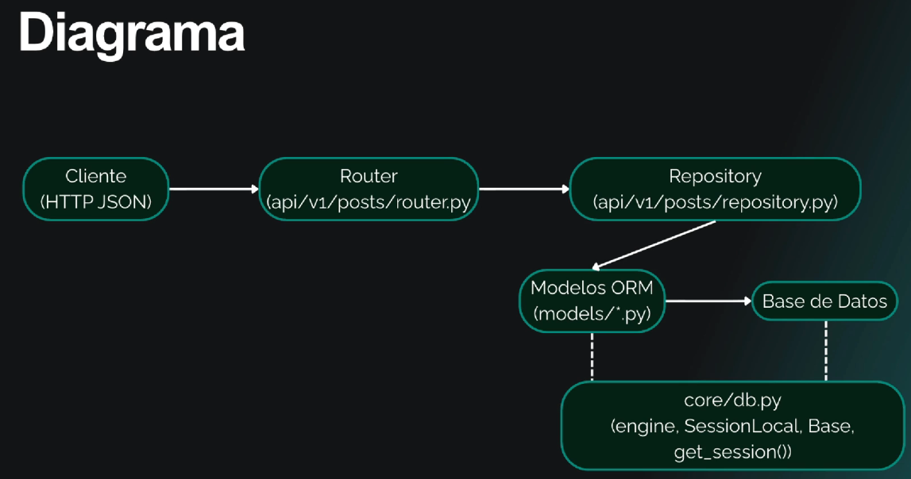
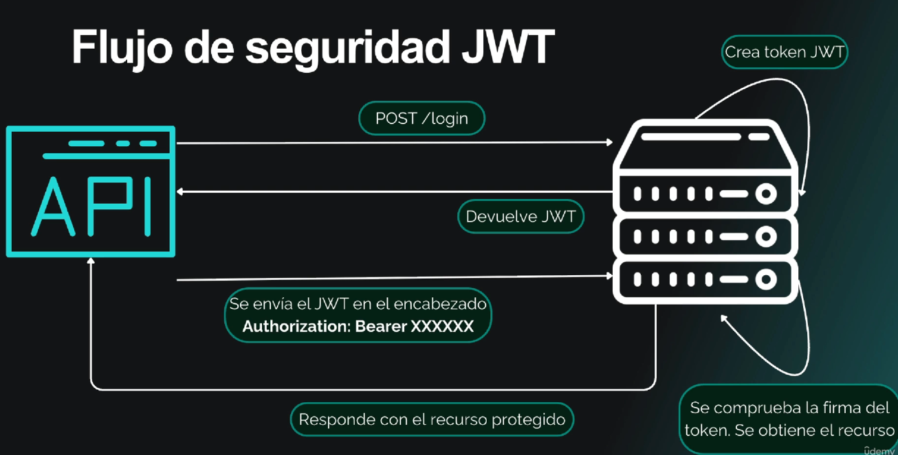

# Notas FastAPI 

- El orden afecta cual se va a mostrar, si tengo dos con mismo metodo, prevalecera la que primero aparece
- **Query params:** son los que van despues de `?`
- **Path params:** son los que van en la url con `/`
- **Put:** similar a post pero busca es actualizar
- **Patch:** similar a put pero es algo *parcial*

- método para probar endpoints desde **Powershell**, en este caso con **post**
```powershell
Invoke-RestMethod -Uri "http://127.0.0.1:8000/posts" -Method POST `
>> -Headers @{"Content-Type" = "application/json"} `
>> -Body '{"title":"Cristiano Ronaldo won the WC2026","content":"The GOA7 of the hat-tricks"}'
```

# 📊 Códigos de Estado HTTP

| Código | Nombre                 | Descripción breve                                   |
| ------ | ---------------------- | --------------------------------------------------- |
| 100    | Continue               | El servidor recibió la solicitud inicial, continuar |
| 101    | Switching Protocols    | Cambio de protocolo solicitado                      |
| 200    | OK                     | Solicitud exitosa                                   |
| 201    | Created                | Recurso creado correctamente                        |
| 202    | Accepted               | Solicitud aceptada, pero no procesada aún           |
| 204    | No Content             | Sin contenido en la respuesta                       |
| 301    | Moved Permanently      | Recurso movido permanentemente                      |
| 302    | Found                  | Redirección temporal                                |
| 304    | Not Modified           | Recurso no ha cambiado                              |
| 400    | Bad Request            | Solicitud incorrecta                                |
| 401    | Unauthorized           | Falta autenticación                                 |
| 403    | Forbidden              | Acceso prohibido                                    |
| 404    | Not Found              | Recurso no encontrado                               |
| 405    | Method Not Allowed     | Método no permitido                                 |
| 408    | Request Timeout        | Tiempo de espera agotado                            |
| 409    | Conflict               | Conflicto en la solicitud                           |
| 410    | Gone                   | Recurso eliminado permanentemente                   |
| 415    | Unsupported Media Type | Tipo de contenido no soportado                      |
| 429    | Too Many Requests      | Demasiadas solicitudes                              |
| 500    | Internal Server Error  | Error interno del servidor                          |
| 501    | Not Implemented        | Funcionalidad no implementada                       |
| 502    | Bad Gateway            | Respuesta inválida de otro servidor                 |
| 503    | Service Unavailable    | Servicio no disponible                              |
| 504    | Gateway Timeout        | Tiempo de espera agotado en gateway                 |

## Status Codes

- Podemos usar los `status_code` con `HTTPException` levantando la excepción definiendo el código y el detalle
- Ademas para una respuesta correcta general la ponemos pasar como parametro en el decorador de la ruta como `status_code` indicando el código de estado que devuelve el **endpoint**

# 🔧 Verbos (Métodos) HTTP

| Método  | Descripción                                |
| ------- | ------------------------------------------ |
| GET     | Obtiene datos de un recurso                |
| POST    | Envía datos para crear un recurso          |
| PUT     | Reemplaza completamente un recurso         |
| PATCH   | Modifica parcialmente un recurso           |
| DELETE  | Elimina un recurso                         |
| HEAD    | Igual que GET pero sin cuerpo de respuesta |
| OPTIONS | Devuelve los métodos permitidos            |
| TRACE   | Devuelve la solicitud recibida (debug)     |
| CONNECT | Establece un túnel con el servidor         |


## BaseModel

- Permite poner modelos de los objetos con los que trabajemos
- Añadirles validaciones
- Añadirles metadatos 
- Podemos hacer validaciones personalizadas con **decoradores** de `@classmethod` y `@field_validator("atributo")`, el cual recibe la clase y el valor

### ResponseModel

- Basandonos en el `BaseModel` podemos usar un atributo podemos definir el objeto de la respuesta de la misma forma, en este caso este parametro se pasa en el decorador de la ruta como `response_model`. Tambien podemos especificarlo si es una lista con el tipo de valor creado y asi sucesivamente.

# Union

Union o `|` le da importancia al orden, es decir, si el primer valor del **or** cumple la condición usa ese. Esto es importante para cuando definamos valores de respuesta del modelo, ya que si el primero tiene lo mas que el segundo, pero los que le faltan son opcionales seguira usando el primero.

Esto se evidencia en el código cuando usamos:

```Python
class PostBase(BaseModel):
    title: str
    content: str | None = "Contenido no disponible"

class PostPublic(PostBase):
    id: int  # Añado lo que hace falta el resto lo heredo


class PostSummary(BaseModel):
    id: int
    title: str
```

Donde si en un `response_model=PostPublic | PostSummary` siempre usará el primero asi devolvamos solo `id` y `title`. Esto debido a que el primero el `content` es opcional, devolviendonos todos los atributos id, titulo y contenido *(nunca evaluaría PostSummary)*. La solución es invertir el orden de evaluación del **or**. Entonces validará primero `PostSummary` y si este tiene solo `id` y `title` devolvera esa *clase*, y si este tiene id, titulo y contenido devolverá `PostPublic` haciendo que se evalúe correctamente el criterio de las dos clases de respuesta para este caso.

*Nota: importante tener en cuenta el orden, ya que se evalua de izquierda a derecha con los OR*

# Path y Query

Son usados para agregarle validaciones adicionales a los parametros enviados en el **endpoint**.
- Query se usa con `Annotated`

# Paginación, Offset

- Mediante parametros query podemos filtrar la cantidad de datos, el orden y segun que valor tomaremos el orden de los datos a mostrar haciendo mas optima la carga sin tener que cargar todos los datos.

# Multiples parametros

- Recibe una lista de varios elementos

# Deprecated

- Atributo en Query o Path `deprecated` que es booleano

---

# Bases de datos relaciones en FastAPI

## SQLAlchemy

- ORM Maduro
- Soporta modelos declarativos
- ORM o SQL puro
- Comunidad amplia
- Compatibilidad con multiples bases de datos
- *desventajas:* requiere mas configuración y curva de aprendizaje alta

## SQLModel

- Hecho por el creador de FastAPI
- Combina SQLAlchemy ORM con Pydantic
- Tipado moderno
- Mas simple y declarativo que SQLAlchemy
- Modelos reutilizables: sirve para DB y validación de datos
- Mejor experiencia para proyectos nuevos
- *desventajas:* No tiene la flexibilidad de SQLAlchemy y menor comunidad

## ¿Cuál Eligir?

- Proyecto pequeño, nuevo o prototipo de FastAPI es mejor usar SQLModel
- Proyecto empresa grande o mediana, mejor usar SQLAlchemy *(mas probable de encontrar en el mercado laboral)*

## ¿Cómo configurar nuestro proyecto?

1. Instalar SQLAlchemy
2. Instalar el driver de la base de datos, en este caso `"psycopg[binary]"`
3. URL de la base de datos
4. Función para conectarse y cerrar sesion *(Opcional)*
5. Clase declarativa para modelos de la base de datos
6. Con clase declarativa crear tablas a modo de clases
7. Metodo de creación de todas las tablas en caso de que no existan *(Recomendado solo en desarrollo)*
8. Agregar `model_config()` en las clases de fastapi para enviarle los datos al ORM
9. Le pasamos la sesion a los endpoints con `Session = Depends(get_db)`, `get_db` es la función de conexión a la db y salida.

## ORM

- Es mejor utilizar las consultas del ORM, evitar cargar todo en memoria gestionando las consultas inteligentemente
- Agilizan mas el código aprovechando el SQL
- Al usar `model_config()` y queremos retornar objetos necesitamos usar `model_validate(from_attributes=True)` a cada objeto que retornemos
- `db.refresh()` no es necesario cuando usamos un **delete**
- Tener presente que con SQLite si ya se creo la tabla, y luego la modificamos no la modificará ya que detectara que ya existe y no la crea desde cero.

## Agregando mas tablas para relaciones

- Agregar clases de los modelos ORM

### Relación 1:n

Relacionaremos **Posts** y **Authors**.

1. En Autores:

```Python
posts: Mapped[list["PostORM"]] = relationship(back_populates="author")
```

Donde tendremos un campo de tipo lista que recibe la clase `PostORM` *(la tabla de posts)* relacionada con el campo `author` en la tabla `Posts` de la clase `PostORM`

2. En Posts:

```Python
# Relación con Author
author_id: Mapped[int | None] = mapped_column(
    ForeignKey("authors.id"), nullable=True)  # Llave foranea
author: Mapped["AuthorORM" | None] = relationship(back_populates="posts")
```

Creamos el campo de la llave foranea y realizamos la relación mediante el campo `author`, donde un post tiene un autor.

### Relación n:m

1. Crear tabla intermedia:

```Python
# Tabla intermedia para muchos a muchos
post_tags = Table(
    "post_tags",
    Base.metadata,
    Column("post_id", ForeignKey(
        "posts.id", ondelete="CASCADE"), primary_key=True),
    Column("tag_id", ForeignKey("tags.id", ondelete="CASCADE"), primary_key=True)
)
```

- La tabla tiene borrado en cascada
- En este caso una llave compuesta


2. En Posts:

```Python
# Relación con Tags
tags: Mapped[list["TagORM"]] = relationship(
    secondary=post_tags,  # Cual tabla ocupare, Post -> post_tags
    back_populates="posts",  # Acceder mediante posts
    lazy="selectin",  # Busqueda mediante un selectin
    passive_deletes=True  # Respetar el delete on cascade
)
```

- Indicamos la tabla de enlace
- Se llena de acuerdo a cual campo hace referencia, no la tabla intermedia ya que esta es el puente
- `selectin` es una selección con join que esta optimizada
- `passive_deletes` hace que los borrados se encargue la DB

3. En Tags:

```Python
# Relación inversa con Posts
posts: Mapped[list["PostORM"]] = relationship(
    secondary=post_tags,
    back_populates="tags",
    lazy="selectin",
    passive_deletes=True
)
```

- Similar que en Posts

---

## Revisar Validaciones de las clases en Pydantic 

- Crear los `model_config` necesarios

## Filtrar tags
- `selectinload(PostORM.tags)`: trae tags *(en nuestro ejemplo)* en una query extra optimizada, evita N+1
- `joinedload(PostORM.author)`: hace **join** directo con autor, útil porque es 1 a muchos *(mas liviano)*

Importante porque sino cargo relaciones previamente se generan **N+1 queries** al serializar

```Python
.where(
    PostORM.tags.any(
        func.lower(TagORM.name).in_(normalized_tag_names)
    )
)
```

- Trae los posts donde exista al menos un tag cuyo nombre esté en la lista, equivalente:

```SQL
SELECT *
FROM posts
WHERE EXISTS (
    SELECT 1
    FROM post_tags
    JOIN tags ON tags.id = post_tags.tag_id
    WHERE post_tags.post_id = posts.id
    AND LOWER(tags.name) IN ('python', 'fastapi')
);
```

### N + 1 Queries

- 1 query inicial
- N queries adicionales, una por cada resultado

Entonces cambia esto:

```SQL
SELECT * FROM tags WHERE post_id = 1;
SELECT * FROM tags WHERE post_id = 2;
SELECT * FROM tags WHERE post_id = 3;
```

Un problema porque las relaciones por defecto son lazy ("select") `No cargues los tags hasta que alguien los pida`, y cuando se llaman en el return, python hace esto:

```Python
for post in posts:
    post.tags   # ← aquí se dispara la query
```

Serializando varias consultas ineficientemente. Por eso se soluciona con esto:

```SQL
-- 1. Trae posts
SELECT * FROM posts;

-- 2. Trae TODOS los tags de esos posts en una sola query
SELECT * FROM tags
JOIN post_tags ...
WHERE post_id IN (1,2,3,4,5);
```

**¿Cuándo usar cada uno?**

- `many-to-many/listas`: `selectinload`
- `many-to-one (author)`: `joinedload`

---

## Conectarle PostgreSQL

- **recomendado:** usar variables de entorno
- `load_dotenv()` cargar variables de entorno
- sentencia `f"postgresql+psycopg://{user}:{password}@{server}:{port}/{database}"`

---

## Código Sección

- [GitHub código seccion curso](https://github.com/DevTalles-corp/fastapi-first-steps/tree/section-6-database-sqlalchemy)

> Recordar que `refresh()` hace una recarga de los datos de la db, y sino he hecho `commit` es como si no hubiera hecho nada

---

# Arquitectura y Modularización

## Estructura de Archivos

- Arquitectura simple: `app/main.py` **No es manejable ni legible**

Recomendaciones: *(No existe un respuesta a la arquitectura estandar)*

**V1**

- app/
  - main.py
  - core/
    - db.py
  - models/
    - author.py
    - tag.py
    - post.py
  - api/
    - posts.py

**V2**

- app/
  - main.py
  - core/
    - db.py
  - models/
    - author.py
    - tag.py
    - post.py
  - api/
    - v1/
      - posts/
        - router.py
        - schemas.py
        - repository.py

**V3 (Mas extendida)**

- app/
  - main.py
  - core/
    - db.py
    - config.py
    - exceptions.py
    - security.py
    - logging.py
    - deps.py
  - models/
    - user.py
    - author.py
    - tag.py
    - post.py
    - webhook_event.py
  - api/
    - v1/
      - posts/
        - router.py
        - schemas.py
        - repository.py
        - service.py
      - authors/
      - tags/
      - auth/
      - webhooks/
      - sockets/
  - migrations/
  - tests/

**V4 (Proyecto Fullstack en FastAPI)**

- app/
  - main.py
  - api/
    - \__init__.py
    - deps.py
    - routers/
      - \__init__.py
      - users.py
      - auth.py
      - posts.py
  - core/
    - config.py
    - security.py
    - logging.py
  - db/
    - session.py
    - migrations.py
  - models/
    - user.py
    - post.py
  - schemas/
    - user.py
    - post.py
  - repositories/
    - user.py
    - post.py
  - services/
    - user_service.py
    - post_service.py
  - utils/
- tests/
  - conftest.py
  - test_users.py
  - test_posts.py
- alembic.ini
- .env.example
- pyproject.toml/requirements.txt

---

## Arquitectura de capas

- Routers muy grandes
- SQL duplicado
- Riesgo de exposición de campos

Mapa de capas, ejemplo: en un restaurante:

- Router: mesero
- DTO de entrada: orden del cliente *(validación)*
- Repository DB/modelos: chefs/cocineros
- DTO de salida: recibo del cliente *(validación de proceso)*

### DTO (Data Transfer Object)

- Contrato del API (input/output)
- Independiente de la DB
- Valida lo que entra, controla lo que sale
- Facilita el versionado de la API

### Repository Pattern

- Único lugar con las consultas del dominio
- Evita duplicación, facilita optimizar y testear
- No decide sobre acciones HTTP *(commit/rollback)*

### Router

- Recibe y valida los parámetros
- Inyecta dependencias *(DI)*: crea las sesiones que todo funcione
- Orquesta la operación llamando a repository
- Controla la transacción del request
- Traducir errores técnicos
- Serializar la respuesta usando los DTO

### Unit of Work + DI

- El router hace `commit/rollback`
- Repository puede usar `flush/refresh`
- DI: `Depends(get_session)` controla vida útil de la sesión

### Diagrama



> Repository tambien devuelve la respuesta*

---

**Ocuparemos la estructura v2**

# Estructura

## Core

- Creamos el `db.py` y movemos ahi lo relacionado a las bases de datos:
  - Endpoint de la base de datos
  - Sesion de la DB
  - Clases declarativa base
  - Función de inicio y cierre de sesion

## Models

- Creamos un archivo de python para cada modelo
- Movemos las clases de las tablas
- post_tags en Tags lo podemos poner en texto, e mover post_tags en Posts
- Para los enlaces a las clases mapeadas para fastapi que son de texto hay 2 opciones:
  - Dejarlas asi en texto *(tener presente que cuando se importe pues si se importa en orden no habra problema)*
  - Evitar ese error de pylance, `from __future__ import annotations` y `from typing import TYPE_CHECKING` y ponemos:

```Python
if TYPE_CHECKING:
    from .post import PostORM # Y asi con las que falten
```

> Evitando importacions circulares


## API

- Creamos una carpeta `v1/posts` *(v1 es solo para manejar versiones)*
- Dentro de `posts` creamos el archivo `schemas.py`
- En schemas irán todas las validaciones que hicimos con `pydantic` y tambien todas las clases que ocupamos como base para `FastAPI`

### Archivo Repository

- Guarda todas las consultas, lógica
- Router envía lo que necesite y el repository le envía lo que solicitá
- El router decide que hacer con ellas

Para ello

- Cremos un `repository.py` dentro de `api/posts`
- Creamos las funciones para poder acceder a ellas por medio del router
- Creamos una clase para ocuparla como *Repositorio*

> De tal manera que ahora el que se encarga de las consultas a la DB es repository

- Dentro de la clase vamos creando funciones que necesitemos en los endpoints como obtener, actualizar, de tal manera que interactuen con la DB y no lo hagan los endpoints

### Router

- Dentro de `app/api/posts` crear el archivo `router.py`
- Importamos el repositorio, esquemas, función de acceso a la DB y `APIRouter` de fastapi
- **APIRouter** reemplazará el `app.get` y se hará un poco mas corto el endpoint
- Movemos todos los endpoints a ese archivo y empezamos a reemplazar con ayuda del `PostRepository`

---

## Main

- Apenas terminemos de ajuster el router, tenemos que montar el router en el `main.py` ya que ese es el archivo principal
- Creamos una función para crear la `app` de *FastAPI*
- Importamos el router

> No olvidar crear los `__init__.py` dentro de `app` para que permita su ejecución

Para ejecutar en Windows:

```bash
fastapi dev .\app\main.py
```

Ya que movimos el main de ruta dentro de **app/**

---

# Dependencias

- En FastAPI es una función que se puede inyectar automaticamente en los endpoints, como la función `get_db()`
- Permite reutilizar el código. Una conexión y que todos los endpoints la ocupen.
- FastAPI las resuelve antes de ejecutar el endpoint

ejemplo:

```Python
# Dependencia


def get_fake_user():
    return {"username": "Sebpro", "role": "admin"}

# Ruta de prueba de la dependencia


@router.get("/me")
def read_me(user: dict = Depends(get_fake_user)):
    return {"user": user}
```

---

# Autenticación y Autorización

- **Autenticación**: Verifica quien eres.
- **Autorización**: Que puedes hacer, tu rol o permisos.

## ¿Por Qué proteger APIs?

- **Seguridad**: no cualquiera puede hacer cualquier acción
- **Persistencia**: evitar accesos no autorizados a borrar
- **Permisos**: que gestione quien puede hacer que

## JWT

- **JSON WEB TOKEN**: Token que viaja entre cliente-servidor. Le permite al cliente demostrar su identidad.

### Partes de un JWT


```JSON
// Header
{
  "alg": "RS256", //Algoritmo
  "typ": "JWT",
  ...
}

// Payload
{
  "name": "Cristiano Ronaldo",
  "exp": 123213213,
  "sub": "0000000-0000000-111111-fd231231",
  "admin": true,
  ...
}

// Signature
<cryptographic signature to ensure integrity>
```

### Flujo de seguridad JWT



**Comparación con sesiones tradicionales**

- Algunos frameworks ocupan sesiones clásicas *(Django, PHP)*. El servidor guarda en la memoria/DB y el cliente manda las cookies
- JWT: el estado viaja en el token, el servidor es *stateless*. Es muy útil porque no depende de un único servidor. *Es decir, la API no recuerda nada de tus requests*.

### Oauth2passwordbearer

- Dependencia de FastAPI, que nos permite extraer automaticamente un token JWT.
- Dentro de `core/` crear un archivo `security.py`

```Python
from fastapi.security import OAuth2PasswordBearer

# Esa es la ruta que debe usar el cliente para poderse autenticar
oauth2_scheme = OAuth2PasswordBearer(tokenUrl="/api/v1/auth/login")
```

- Ahora en el archivo de `router.py`

### Crear token

> Según la documentación se recomienda la librería `PyJWT`

- En `app/v1` creamos `auth/` y dentro creamos:
  - `router.py` 
  - `schemas.py`

Separando esta carpeta de autenticación de posts, ya que tiene un fin distinto.

- Dentro del archivo de `security` agregamos la constante `SECRET_KEY, ALGORITHM, ACCESS_TOKEN_EXPIRE_MINUTES`
- Creamos funciones para decodificar y codificar
- Creamos función para obtener el usuario al cual estamos intentando acceder

- Dentro de los `schemas.py`:
  - Crear modelos de respuesta:
    - para el token
    - los datos del token
    - los datos del usuario *(el que inicia sesion)*

- Dentro de `router.py`:

```Python
FAKE_USERS = {
    "ricardo@example.com": {"email": "ricardo@example.com", "username": "ricardo", "password": "secret123"},
    "alumno@example.com":  {"email": "alumno@example.com",  "username": "alumno",  "password": "123456"},
}
```

> Usaremos estos usuarios de ejemplo.

- Creamos el login y la lectura de datos del usuario *(esta 2da es mas de verificación)*
- Ahora sería poner el router dentro del main

> Mediane el candado de la documentación podemos hacer un read_me, para validar el usuario fake que creamos

- FastAPI tiene un candado, donde podemos darle clic para probar la validación del token:


## Protegiendo Rutas

- Con la función `get_current_user` podremos limitar algunas rutas
- En router validamos cuales serán publicas y cuales no:
  - `create_post, update_post & delete_post` haremos que no sea **público**
- Importamos `get_current_user` y se lo pasamos como parametro en una dependencia al método

Entonces si probamos el método sin autenticarnos, nos dará el error `401 Unauthorized`. Una vez nos autentiquemos ya podremos ejecutar el método.

## Cambiando implementación de las rutas

- Ya no se enviará el autor al crear el post
- Lo ideal es que como ahora el esta logeado, el post que se publique se le de con el autor del que lo publica
- Para ello vamos al `create_post` y modificamos para que reciba el usuario en vez de validar el json, con eso ese dato será directo desde la validación automatica y no de la entrada del usuario, evitando errores de escritura.
  - Esto tambien necesitará modificar el `repository` ya que el campo que trae es `username` y no `name`
  - Tambien el `schema` ya que ahora no necesitamos enviarle el autor

> Ahora cada que creemos usuario no necesitaremos poner esa información, será automática y evitara errores.

## Control de errores

- En `security` en `get_current_user` esa variable solo se debe dedicar a esa función. Entonces quitamos el `credentials_exc` de la función y lo ponemos global. Ademas como recomendación:
  - Podemos crear funciones enfocadas en el control de errores
  - Manejarlo en un archivo separado
- Otra opción es como esta ahora con la variable
- Otra opción es una función enfocada en el error `raise_expired_token` por ejemplo

> [Código Sección Security](https://github.com/DevTalles-corp/fastapi-first-steps/tree/section-8-auth-security) 